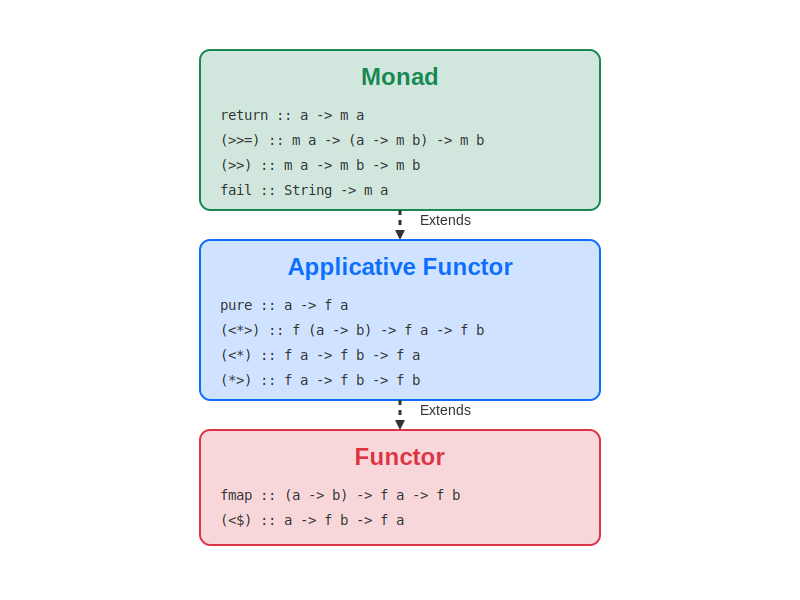

# Monadic-Monograph

Initially, this is meant to be a record of the Haskell course I enrolled in at Uni.

### Synopsis: Functional Programming and Category Theory

> Functonal paradigm have developed many concepts in writing clean, maintainable, and expressive code.

> In this course, we explored the foundational concepts of functional programming and their connections to category theory. 

### Key fundamentals:

Programmer's glossary:
- **Pure Functions**: Functions that always produce the same output for the same input and have no side effects.
- **Higher-Order Functions**: Functions that take other functions as arguments or return them as results.
- **Functors**: Wrapper that provides an implementation of fmap - a map for its wrapped objects ([see below](#functor-applicative-moand-hierarchy-scheme))
- **Applicative**: ??? ([see below](#functor-applicative-moand-hierarchy-scheme))
- **Monads**: A type of (endo-)functor that allows for the chaining of operations while managing side effects, encapsulating values, and providing a context for computation. ([see below](#functor-applicative-moand-hierarchy-scheme))

Mathematician's glossary:
- **Pure Functions**: Functions.
- **Higher-Order Functions**: Functional on a vector space of functions, that is a mapping from the space to any other space or field.
- **Functors**: Mappings between categories that preserve the structure of categories, similar to homomorphisms for algebraic structures like groups and fields.
- **Applicative**: ???
- **Monads**: As notoriously known, a monad in X is just a monoid in the category of endofunctors in X. 
